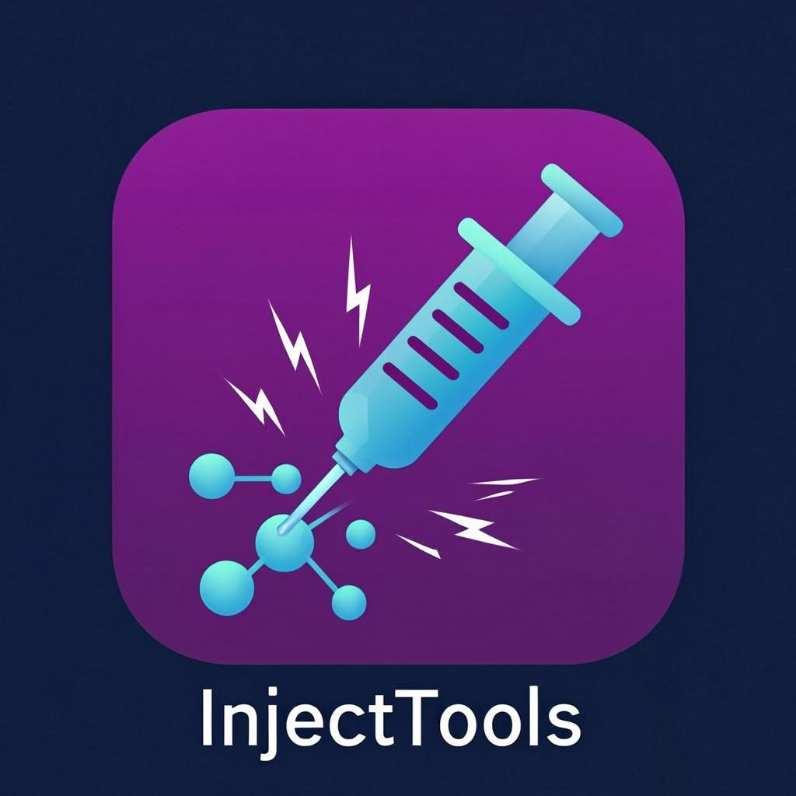

<p align="center">
  
</p>

<h1 align="center">InjectTools</h1>

<p align="center">
  <strong>A powerful Android application for scanning and testing host injection vulnerabilities</strong>
</p>

<p align="center">
  <a href="#features">Features</a> •
  <a href="#screenshots">Screenshots</a> •
  <a href="#installation">Installation</a> •
  <a href="#usage">Usage</a> •
  <a href="#tech-stack">Tech Stack</a> •
  <a href="#contributing">Contributing</a> •
  <a href="#license">License</a>
</p>

<p align="center">
  
  
  
  
  
</p>

---

## Overview

**InjectTools** is a specialized Android application designed for network administrators, security researchers, and VPN enthusiasts who need to identify and test host injection vulnerabilities. The application provides an intuitive interface to scan DNS records, test individual hosts, and maintain a comprehensive history of successful connections.

## Features

### 🔍 Single Bug Testing
Test individual subdomains or hosts against your target VPN server configuration. Get instant feedback on connection status, IP resolution, and latency metrics.

### 🌐 Mass Scanning via DNS Records
Leverage Certificate Transparency logs through `crt.sh` to automatically discover and test multiple subdomains. The application efficiently processes DNS records to identify working injection points.

### 📊 Session History Management
- Automatically save successful scan results
- View detailed connection information including IP addresses and latency
- Delete individual sessions or clear all history
- Persistent storage across app sessions

### 🎨 Modern User Interface
- Built with Jetpack Compose and Material Design 3
- Dynamic color theming with Material You support (Android 12+)
- Smooth animations and intuitive navigation
- Dark and light mode support

### ⚡ Performance Optimized
- Concurrent scanning with configurable thread limits
- Efficient network operations with timeout handling
- Minimal battery consumption during scans

## Screenshots

<p align="center">
  
  
  
</p>

## Installation

### Prerequisites
- Android device running **Android 7.0 (Nougat)** or higher
- Internet connection for scanning operations

### Download
Download the latest APK from the [Releases](https://github.com/hoshiyomiX/InjectTools/releases) page.

### Build from Source

```bash
# Clone the repository
git clone https://github.com/hoshiyomiX/InjectTools.git
cd InjectTools

# Build debug APK
./gradlew assembleDebug

# Build release APK
./gradlew assembleRelease
```

The compiled APK will be available in `app/build/outputs/apk/`.

## Usage

### Initial Setup
1. Launch the application
2. On first run, you'll be prompted to enter your VPN provider's host server
3. Enter the host address (e.g., `sg.server.web.id`) and tap **Mulai Gas**

### Testing a Single Host
1. Tap **Test Bug** from the main menu
2. Enter the subdomain you wish to test
3. View the results showing connection status, IP, and latency

### Mass Scanning
1. Tap **Scan & Test Bug** from the main menu
2. Enter a domain to scan
3. The app will fetch subdomains from Certificate Transparency logs
4. Results are automatically saved to history upon completion

### Viewing History
1. Tap **History** from the main menu
2. Browse through your previous successful scans
3. Tap on a session to expand and view detailed results
4. Delete individual sessions by tapping the delete icon

### Managing Target Host
- Tap the host card on the main screen to update your target server
- The host setting persists across app sessions

## Tech Stack

| Category | Technology |
|----------|------------|
| Language | Kotlin |
| UI Framework | Jetpack Compose |
| Design System | Material Design 3 |
| Architecture | MVVM |
| Networking | OkHttp |
| Async | Kotlin Coroutines |
| Storage | SharedPreferences |

## Project Structure

```
app/
├── src/main/
│   ├── java/com/deviant/injecttools/
│   │   ├── MainActivity.kt        # Main UI and navigation
│   │   ├── Scanner.kt             # Core scanning logic
│   │   ├── Crtsh.kt               # Certificate Transparency fetcher
│   │   ├── SubdomainFetcher.kt    # DNS record processing
│   │   ├── NetworkUtils.kt        # Network utilities
│   │   └── HistoryStorage.kt      # Session persistence
│   └── res/
│       └── mipmap-*/              # App icons
└── build.gradle                   # Module configuration
```

## Contributing

Contributions are welcome! Here's how you can help:

1. **Fork** the repository
2. **Create** a feature branch (`git checkout -b feature/amazing-feature`)
3. **Commit** your changes (`git commit -m 'Add amazing feature'`)
4. **Push** to the branch (`git push origin feature/amazing-feature`)
5. **Open** a Pull Request

Please make sure to update tests as appropriate and follow the existing code style.

### Code Style
- Follow [Kotlin coding conventions](https://kotlinlang.org/docs/coding-conventions.html)
- Use meaningful variable and function names
- Add comments for complex logic

## Security Considerations

This tool is intended for legitimate network testing purposes only. Users are responsible for ensuring they have proper authorization before testing any hosts or networks. The developers are not responsible for misuse of this application.

## Roadmap

- [ ] Export history to CSV/JSON
- [ ] Multiple target host profiles
- [ ] Custom scanning presets
- [ ] Notification on scan completion
- [ ] Widget for quick testing
- [ ] IPv6 support

## Known Issues

See the [Issues](https://github.com/hoshiyomiX/InjectTools/issues) page for a list of known issues and feature requests.

## License

This project is licensed under the MIT License - see the [LICENSE](LICENSE) file for details.

## Author

<p align="center">
  <strong>Hoshiyomi</strong>
</p>

<p align="center">
  <a href="https://t.me/hoshiyomi_id">
    
  </a>
</p>

---

<p align="center">
  Made with ❤️ in Indonesia
</p>

<p align="center">
  <sub>If you find this project useful, please consider giving it a ⭐ star!</sub>
</p>
