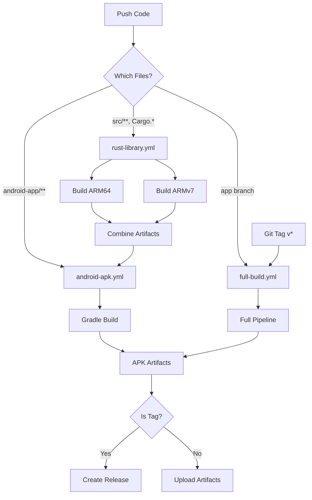

# CI/CD Workflows

InjectTools uses GitHub Actions for automated builds. There are 3 workflows:

## Workflows Overview

### 1. Build Rust Library (`rust-library.yml`)

**Purpose:** Build `libinjecttools.so` for Android

**Triggers:**
- Push to `android-apk-migration`, `app`, `main` branches
- Changes to `src/**`, `Cargo.toml`, `Cargo.lock`
- Pull requests
- Manual dispatch

**Outputs:**
- `libinjecttools-aarch64-linux-android` (ARM64)
- `libinjecttools-armv7-linux-androideabi` (ARMv7)
- `android-jniLibs-all` (combined)

**Build Matrix:**
```yaml
strategy:
  matrix:
    target:
      - aarch64-linux-android  # Modern devices (64-bit)
      - armv7-linux-androideabi # Older devices (32-bit)
```

**Stages:**
1. **Setup Environment**
   - Checkout code
   - Install Rust toolchain
   - Setup Android NDK r26d
   - Configure Cargo for Android

2. **Build**
   - Parallel builds for ARM64 and ARMv7
   - Aggressive caching (Cargo registry, git, build artifacts)
   - Configure linker (clang from NDK)

3. **Package**
   - Create jniLibs structure:
     ```
     jniLibs/
     ├── arm64-v8a/
     │   ├── libinjecttools.so
     │   └── BUILD_INFO.txt
     └── armeabi-v7a/
         ├── libinjecttools.so
         └── BUILD_INFO.txt
     ```

4. **Upload Artifacts**
   - Individual architecture artifacts (30 days retention)
   - Combined `android-jniLibs-all` (90 days retention)

5. **Release (on tags)**
   - Create `libinjecttools-android-all.tar.gz`
   - Attach to GitHub release

**Estimated Duration:** ~8-12 minutes (parallel)

---

### 2. Build Android APK (`android-apk.yml`)

**Purpose:** Build InjectTools APK with Gradle

**Triggers:**
- Push to `android-apk-migration`, `app` branches
- Changes to `android-app/**`
- Pull requests
- Manual dispatch
- **Automatic:** After successful `rust-library.yml` completion

**Dependencies:**
- Requires `android-jniLibs-all` artifact from Rust build

**Stages:**
1. **Setup**
   - Checkout code
   - Setup JDK 17 (Temurin)
   - Setup Android SDK

2. **Download Libraries**
   - Download `android-jniLibs-all` artifact
   - Place in `android-app/app/src/main/jniLibs/`
   - Verify both ARM64 and ARMv7 `.so` files exist

3. **Build**
   - Gradle cache (dependencies, wrapper)
   - `./gradlew assembleDebug` → Debug APK
   - `./gradlew assembleRelease` → Release APK

4. **Sign (TODO)**
   - Release APK signing with keystore
   - Requires GitHub Secrets setup

5. **Upload Artifacts**
   - `injecttools-debug-apk` (30 days)
   - `injecttools-release-apk` (90 days)

6. **Release (on tags)**
   - Attach signed APK to GitHub release

**Outputs:**
- `app-debug.apk` (~10-15 MB)
- `app-release-unsigned.apk` (~8-12 MB)

**Estimated Duration:** ~5-8 minutes

---

### 3. Full Build Pipeline (`full-build.yml`)

**Purpose:** Complete end-to-end build (Rust → APK)

**Triggers:**
- Push to `app` branch (production)
- Git tags `v*` (releases)
- Manual dispatch

**Pipeline Stages:**

```
┌─────────────────────────────────────────────┐
│ Stage 1: Build Rust Libraries (Parallel)   │
│  ├─ ARM64 (aarch64-linux-android)          │
│  └─ ARMv7 (armv7-linux-androideabi)        │
└─────────────────────────────────────────────┘
                    ↓
┌─────────────────────────────────────────────┐
│ Stage 2: Build Android APK                 │
│  ├─ Download Rust libraries                │
│  ├─ Gradle build                            │
│  └─ Upload APK artifacts                    │
└─────────────────────────────────────────────┘
                    ↓
┌─────────────────────────────────────────────┐
│ Stage 3: Generate Build Report             │
│  └─ Summary with APK sizes & metadata      │
└─────────────────────────────────────────────┘
```

**On Git Tags (`v*`):**
- Automatic GitHub Release creation
- Attach signed APK
- Release notes from CHANGELOG.md

**Estimated Duration:** ~15-20 minutes (full pipeline)

---

## Workflow Diagram



---

## Caching Strategy

### Rust Build Cache
```yaml
~/.cargo/registry  # Crate downloads
~/.cargo/git       # Git dependencies
target/            # Compiled artifacts
```
**Cache Key:** `rust-{target}-{Cargo.lock hash}`

**Benefits:**
- First build: ~10 mins
- Cached build: ~3 mins (70% faster)

### Gradle Cache
```yaml
~/.gradle/caches   # Dependencies
~/.gradle/wrapper  # Gradle wrapper
```
**Cache Key:** `gradle-{gradle files hash}`

**Benefits:**
- First build: ~8 mins
- Cached build: ~2 mins (75% faster)

---

## Artifacts

### Rust Library Artifacts

| Name | Contents | Retention |
|------|----------|----------|
| `libinjecttools-aarch64-linux-android` | ARM64 .so | 30 days |
| `libinjecttools-armv7-linux-androideabi` | ARMv7 .so | 30 days |
| `android-jniLibs-all` | Both architectures | 90 days |

**Download:**
```bash
gh run download --repo hoshiyomiX/InjectTools --name android-jniLibs-all
```

### APK Artifacts

| Name | Contents | Retention |
|------|----------|----------|
| `injecttools-debug-apk` | Debug APK | 30 days |
| `injecttools-release-apk` | Release APK | 90 days |
| `InjectTools-APK` | Final APK (full-build) | 90 days |

**Download:**
```bash
gh run download --repo hoshiyomiX/InjectTools --name InjectTools-APK
```

---

## Status Badges

Add to README.md:

```markdown
[](https://github.com/hoshiyomiX/InjectTools/actions/workflows/rust-library.yml)
[](https://github.com/hoshiyomiX/InjectTools/actions/workflows/android-apk.yml)
[](https://github.com/hoshiyomiX/InjectTools/actions/workflows/full-build.yml)
```

---

## Manual Triggers

### Via GitHub UI
1. Go to **Actions** tab
2. Select workflow
3. Click **Run workflow**
4. Choose branch
5. Click **Run workflow** button

### Via GitHub CLI
```bash
# Trigger Rust build
gh workflow run rust-library.yml --ref android-apk-migration

# Trigger APK build
gh workflow run android-apk.yml --ref app

# Trigger full pipeline
gh workflow run full-build.yml --ref app
```

---

## Secrets Configuration

### Required for Release Signing

1. **KEYSTORE_FILE** (base64 encoded)
   ```bash
   base64 -i release.keystore | pbcopy
   ```

2. **KEYSTORE_PASSWORD**
   ```
   Your keystore password
   ```

3. **KEY_ALIAS**
   ```
   Alias name (e.g., "injecttools")
   ```

4. **KEY_PASSWORD**
   ```
   Key password
   ```

### Add to GitHub Secrets
```bash
gh secret set KEYSTORE_FILE < release.keystore.base64
gh secret set KEYSTORE_PASSWORD
gh secret set KEY_ALIAS
gh secret set KEY_PASSWORD
```

---

## Troubleshooting

### Rust Build Fails

**Error:** `linker 'aarch64-linux-android30-clang' not found`

**Fix:** NDK not in PATH. Check workflow step:
```yaml
- name: Add NDK to PATH
  run: echo "$ANDROID_NDK_HOME/toolchains/llvm/prebuilt/linux-x86_64/bin" >> $GITHUB_PATH
```

**Error:** `undefined reference to ...`

**Fix:** Dependency issue. Clear cache:
```bash
gh cache delete --all
```

### APK Build Fails

**Error:** `libinjecttools.so not found`

**Fix:** Rust workflow didn't complete. Check:
1. Go to Actions → rust-library.yml
2. Verify successful completion
3. Re-run android-apk.yml

**Error:** `Gradle build failed`

**Fix:** Check Gradle logs:
```bash
gh run view --log-failed
```

### Cache Issues

**Stale cache causing build failures?**

Clear all caches:
```bash
gh cache list
gh cache delete <cache-key>
```

Or via workflow:
```yaml
- name: Clear cache
  run: rm -rf ~/.cargo target ~/.gradle
```

---

## Performance Tips

### Faster Rust Builds
1. **Use `sccache`** (distributed caching)
2. **Enable incremental compilation** (already default)
3. **Split dependencies** (reduce rebuild frequency)

### Faster Gradle Builds
1. **Configuration cache:** Add `--configuration-cache`
2. **Build cache:** Already enabled
3. **Parallel builds:** `org.gradle.parallel=true`

---

## Release Process

### Creating a Release

1. **Update version in Cargo.toml**
   ```toml
   version = "4.0.0"
   ```

2. **Update CHANGELOG.md**
   ```markdown
   ## [4.0.0] - 2026-01-26
   ```

3. **Commit and tag**
   ```bash
   git commit -am "Release v4.0.0"
   git tag v4.0.0
   git push origin app --tags
   ```

4. **CI automatically:**
   - Builds Rust libraries
   - Builds APK
   - Signs APK (if secrets configured)
   - Creates GitHub Release
   - Attaches APK and .so archives

---

## Monitoring

### View Active Runs
```bash
gh run list
```

### Watch Run in Real-Time
```bash
gh run watch
```

### View Logs
```bash
gh run view --log
```

### Cancel Run
```bash
gh run cancel <run-id>
```

---

## Cost & Resource Usage

### GitHub Actions Minutes

| Workflow | Duration | Minutes/Run |
|----------|----------|-------------|
| rust-library.yml | ~10 min | 20 (2 jobs × 10) |
| android-apk.yml | ~6 min | 6 |
| full-build.yml | ~18 min | 26 |

**Monthly Estimate:**
- 30 commits/month → ~900 minutes
- GitHub Free: 2,000 minutes/month → ✅ Sufficient

### Storage

**Artifacts:** ~500 MB/month
- GitHub Free: 500 MB → ⚠️ Monitor usage

**Recommendation:**
- Use shorter retention for debug builds (7 days)
- Keep release builds longer (90 days)

---

## Future Enhancements

- [ ] Add unit tests workflow
- [ ] Add linting (clippy, ktlint)
- [ ] Add security scanning (cargo audit)
- [ ] Add automatic version bumping
- [ ] Add release notes generation
- [ ] Add APK size tracking
- [ ] Add performance benchmarks
- [ ] Add Docker caching for faster builds

---

## Support

**Issues:** https://github.com/hoshiyomiX/InjectTools/issues

**Actions:** https://github.com/hoshiyomiX/InjectTools/actions
